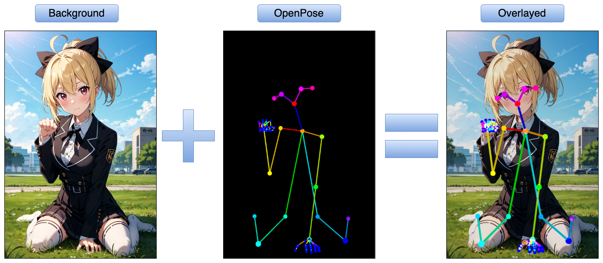

# openpose-overlay



Create OpenPose overlay images by ImageMagick.
OpenPose images works well without alpha channel❗
It would be useful for some Stable Diffusion users.

## Requirements 💿

1. [ImageMagick](https://imagemagick.org/index.php)
2. [Bash](https://www.gnu.org/software/bash/) environment (Not required for Mac OS and Linux users.)
   - Perhaps it will work in other shells as well.

## Get started 🚀

1. Place background images into `backgrounds` directory.
   - Multiple images are supported.
2. Place OpenPose images into `openposes` directory.
3. Execute `overlay.sh` .

   ```bash
   . ./overlay.sh
   ```

   or

   ```bash
   bash ./overlay.sh
   ```

Overlayed images are placed in `outputs` directory.

## Motive 🔥

I'm a OpenPose image creator in [Civitai](https://civitai.com/user/tenpa/models) .
I wanted to create overlayed image for clarity to the viewer.

This tool works well for non-transparent OpenPose images,
which is created by a tool like [PoseMy.art](https://posemy.art/).
